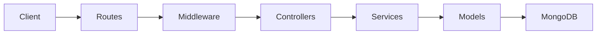

## Overview

CUIDO Backend is built on a modern, scalable architecture using Node.js, Express.js, and MongoDB. The system follows the MVC (Model-View-Controller) pattern with a clear separation between routes, controllers, and services.

## Technology Stack

<CardGroup cols={2}>
  <Card title="Runtime" icon="node-js">
    Node.js with ES Modules
  </Card>
  <Card title="Framework" icon="server">
    Express.js 4.x
  </Card>
  <Card title="Database" icon="database">
    MongoDB with Mongoose ODM
  </Card>
  <Card title="AI Integration" icon="brain">
    Claude API (Anthropic)
  </Card>
</CardGroup>

## Application Structure

The application is initialized in `src/app.js` and follows a layered architecture:

```javascript
// Core Express app setup (src/app.js)
import express from 'express';
import cors from 'cors';
import helmet from 'helmet';
import compression from 'compression';
import rateLimit from 'express-rate-limit';

const app = express();
```

### Middleware Stack

The application uses a comprehensive middleware stack for security and performance:

<Tabs>
  <Tab title="Security">
    **Helmet** - Security headers configuration
    
    ```javascript
    app.use(helmet({
      contentSecurityPolicy: {
        directives: {
          defaultSrc: ["'self'"],
          styleSrc: ["'self'", "'unsafe-inline'"],
          scriptSrc: ["'self'"],
          imgSrc: ["'self'", "data:", "https:"],
        },
      },
      hsts: {
        maxAge: 31536000,
        includeSubDomains: true,
        preload: true
      }
    }));
    ```
    
    **CORS** - Cross-Origin Resource Sharing
    
    ```javascript
    const corsOptions = {
      origin: function (origin, callback) {
        const allowedOrigins = process.env.ALLOWED_ORIGINS?.split(',') || [
          'http://localhost:3000',
          'http://localhost:5173',
          'http://localhost:8080'
        ];
        
        if (!origin || allowedOrigins.includes(origin)) {
          callback(null, true);
        } else {
          callback(new Error('No permitido por CORS'));
        }
      },
      methods: ['GET', 'POST', 'PUT', 'DELETE', 'OPTIONS'],
      allowedHeaders: ['Content-Type', 'Authorization'],
      credentials: true
    };
    ```
  </Tab>
  
  <Tab title="Rate Limiting">
    **Rate Limiter** - Prevents abuse and DDoS attacks
    
    ```javascript
    const limiter = rateLimit({
      windowMs: parseInt(process.env.RATE_LIMIT_WINDOW_MS) || 15 * 60 * 1000,
      max: parseInt(process.env.RATE_LIMIT_MAX_REQUESTS) || 100,
      message: {
        success: false,
        message: 'Demasiadas solicitudes. Intenta más tarde.',
        retryAfter: Math.ceil((parseInt(process.env.RATE_LIMIT_WINDOW_MS) || 900000) / 1000)
      },
      standardHeaders: true,
      legacyHeaders: false
    });
    
    app.use('/api/', limiter);
    ```
    
    <Info>
      Default: 100 requests per 15 minutes per IP address
    </Info>
  </Tab>
  
  <Tab title="Compression & Parsing">
    **Body Parsing** - JSON with validation
    
    ```javascript
    app.use(express.json({ 
      limit: '10mb',
      verify: (req, res, buf) => {
        try {
          JSON.parse(buf);
        } catch (e) {
          res.status(400).json({
            success: false,
            message: 'JSON inválido'
          });
        }
      }
    }));
    ```
    
    **Compression** - Response compression for better performance
    
    ```javascript
    app.use(compression());
    ```
  </Tab>
</Tabs>

## Real-time Features with Socket.IO

CUIDO integrates Socket.IO for real-time notifications and updates:

```javascript
// server.js
import { createServer } from 'http';
import { Server } from 'socket.io';

const httpServer = createServer(app);

const io = new Server(httpServer, {
  cors: {
    origin: process.env.SOCKET_IO_CORS_ORIGINS?.split(',') || [
      'http://localhost:3000',
      'http://localhost:5173',
      'http://localhost:8080'
    ],
    methods: ['GET', 'POST'],
    credentials: true
  }
});

// Socket.IO event handlers
io.on('connection', (socket) => {
  console.log('Cliente conectado:', socket.id);

  socket.on('join-hospital', (hospitalId) => {
    socket.join(`hospital-${hospitalId}`);
  });

  socket.on('join-department', (departmentId) => {
    socket.join(`department-${departmentId}`);
  });

  socket.on('disconnect', () => {
    console.log('Cliente desconectado:', socket.id);
  });
});

// Make io globally available
global.io = io;
```

<Note>
  Socket.IO enables real-time features like instant alerts, live wellness updates, and instant notifications for high-risk employee detection.
</Note>

## Server Initialization

The server startup process includes validation and health checks:

<Accordion title="Server Startup Sequence">
  1. **Environment Variables** - Load and validate configuration
  2. **API Key Validation** - Verify Anthropic API key format
  3. **Database Connection** - Connect to MongoDB
  4. **Claude API Test** - Validate connection to Claude API
  5. **HTTP Server** - Create server with Express app
  6. **Socket.IO Setup** - Initialize WebSocket server
  7. **Scheduled Tasks** - Start cron jobs (if enabled)
  8. **Graceful Shutdown** - Register SIGTERM/SIGINT handlers

  ```javascript
  async function startServer() {
    // Validate API keys
    if (!process.env.ANTHROPIC_API_KEY) {
      logger.error('ANTHROPIC_API_KEY not configured');
      process.exit(1);
    }

    // Connect to database
    await connectDB();
    logger.info('Connected to database');

    // Validate Claude API
    const claudeConnected = await claudeService.validateConnection();
    if (claudeConnected) {
      logger.info('Claude API validated');
    }

    // Start HTTP server
    const server = httpServer.listen(PORT, () => {
      logger.info(`Server running on port ${PORT}`);
    });

    // Initialize cron jobs
    if (process.env.ENABLE_CRON_JOBS === 'true') {
      scheduledTasks.init();
    }
  }
  ```
</Accordion>

## MVC Pattern Implementation

CUIDO follows the Model-View-Controller pattern:



### Layer Responsibilities

<CardGroup cols={3}>
  <Card title="Routes" icon="route">
    Define API endpoints and apply middleware
    
    Location: `src/routes/`
  </Card>
  <Card title="Controllers" icon="gear">
    Handle HTTP requests/responses and input validation
    
    Location: `src/controllers/`
  </Card>
  <Card title="Services" icon="code">
    Contain business logic and interact with models
    
    Location: `src/services/`
  </Card>
</CardGroup>

## Error Handling

Centralized error handling with custom middleware:

```javascript
// Unhandled routes
app.use(notFound);

// Global error handler
app.use(errorHandler);
```

<Info>
  All async route handlers are wrapped with `asyncHandler` utility to catch errors and pass them to the error middleware.
</Info>

## Health Check Endpoint

Monitor service health:

```javascript
app.get('/health', (req, res) => {
  res.status(200).json({
    success: true,
    message: 'Servicio funcionando correctamente',
    timestamp: new Date().toISOString(),
    environment: process.env.NODE_ENV || 'development'
  });
});
```

## Logging

Structured logging with Morgan and custom logger:

```javascript
const morganFormat = process.env.NODE_ENV === 'production' ? 'combined' : 'dev';
app.use(morgan(morganFormat, {
  stream: {
    write: (message) => logger.info(message.trim())
  }
}));
```

## Next Steps

<CardGroup cols={2}>
  <Card title="Authentication" icon="lock" href="/concepts/authentication">
    Learn about JWT authentication and role-based access control
  </Card>
  <Card title="Modules Overview" icon="grid" href="/concepts/modules-overview">
    Explore the 5 CUIDO modules and their architecture
  </Card>
</CardGroup>