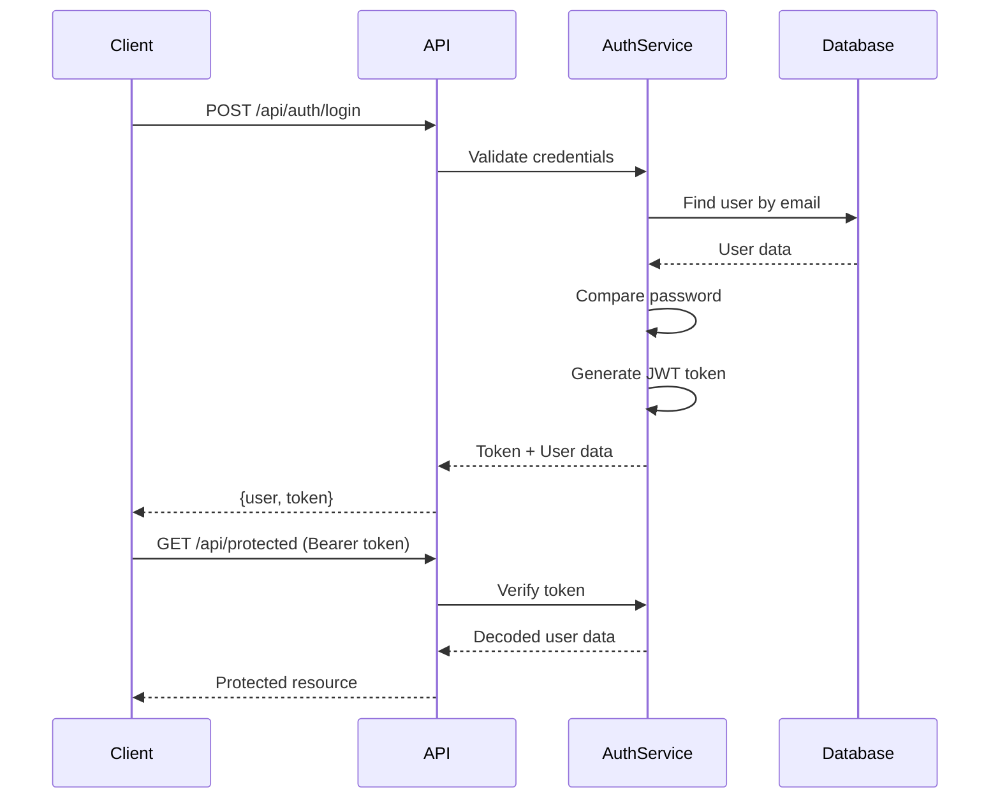

## Overview

CUIDO Backend implements a secure authentication system using JSON Web Tokens (JWT) with role-based access control. The system supports three user roles: `user`, `admin`, and `system`.

## Authentication Flow



## JWT Token Generation

Tokens are generated using the `authService`:

```javascript
// src/services/authService.js
import jwt from 'jsonwebtoken';

class AuthService {
  generateToken(userId) {
    return jwt.sign(
      { userId, timestamp: Date.now() },
      process.env.JWT_SECRET,
      { 
        expiresIn: process.env.JWT_EXPIRES_IN || '7d',
        issuer: 'claude-prompt-api',
        subject: userId.toString()
      }
    );
  }
}
```

<Info>
  Default token expiration: **7 days**. Configure via `JWT_EXPIRES_IN` environment variable.
</Info>

## Token Verification

Token validation with comprehensive error handling:

```javascript
verifyToken(token) {
  try {
    return jwt.verify(token, process.env.JWT_SECRET);
  } catch (error) {
    if (error.name === 'TokenExpiredError') {
      throw new AppError('Token expirado', 401);
    }
    if (error.name === 'JsonWebTokenError') {
      throw new AppError('Token inválido', 401);
    }
    throw new AppError('Error de autenticación', 401);
  }
}
```

## User Registration

Secure user registration with email validation:

```javascript
async register({ name, email, password }) {
  const existingUser = await User.findOne({ email: email.toLowerCase() });
  if (existingUser) {
    throw new AppError('El email ya está registrado', 400);
  }

  const user = new User({ name, email: email.toLowerCase(), password });
  await user.save();

  const token = this.generateToken(user._id);
  
  return {
    user: user.toJSON(),
    token
  };
}
```

<Note>
  Passwords are automatically hashed using bcrypt with a salt rounds of 12 before saving to the database.
</Note>

## User Login

Authenticate users and track login activity:

```javascript
async login({ email, password }) {
  const user = await User.findOne({ 
    email: email.toLowerCase(),
    isActive: true 
  }).select('+password');

  if (!user || !(await user.comparePassword(password))) {
    throw new AppError('Credenciales inválidas', 401);
  }

  // Update last login timestamp
  user.lastLogin = new Date();
  await user.save();

  const token = this.generateToken(user._id);
  
  return {
    user: user.toJSON(),
    token
  };
}
```

## Authentication Middleware

Protect routes with the `authenticate` middleware:

```javascript
// src/middleware/auth.js
import authService from '../services/authService.js';
import { asyncHandler } from '../utils/response.js';

export const authenticate = asyncHandler(async (req, res, next) => {
  const authHeader = req.headers.authorization;

  if (!authHeader || !authHeader.startsWith('Bearer ')) {
    return res.status(401).json({
      success: false,
      message: 'Token de acceso requerido'
    });
  }

  const token = authHeader.substring(7);

  let decoded;
  try {
    decoded = authService.verifyToken(token);
  } catch (error) {
    return res.status(401).json({
      success: false,
      message: 'Token inválido o expirado'
    });
  }

  const user = await authService.getCurrentUser(decoded.userId);

  if (!user) {
    return res.status(401).json({
      success: false,
      message: 'Usuario no encontrado'
    });
  }

  req.user = user;
  req.userId = user._id;
  next();
});
```

### Usage in Routes

```javascript
import { authenticate } from '../middleware/auth.js';

const router = express.Router();

// All routes below require authentication
router.use(authenticate);

router.post('/survey/quick', processQuickSurvey);
router.get('/wellness-heatmap/:hospitalId', getWellnessHeatmap);
```

## Role-Based Authorization

The `authorize` middleware restricts access based on user roles:

```javascript
export const authorize = (...roles) => {
  return (req, res, next) => {
    if (!roles.includes(req.user.role)) {
      return res.status(403).json({
        success: false,
        message: 'No tienes permisos para acceder a este recurso'
      });
    }
    next();
  };
};
```

### Authorization Examples

<Tabs>
  <Tab title="Admin Only">
    ```javascript
    // Only administrators can access
    router.get('/alerts', 
      authenticate, 
      authorize('admin'), 
      getAlerts
    );
    ```
  </Tab>
  
  <Tab title="Admin & User">
    ```javascript
    // Both admin and regular users can access
    router.get('/wellness-heatmap/:hospitalId', 
      authenticate,
      authorize('admin', 'user'), 
      getWellnessHeatmap
    );
    ```
  </Tab>
  
  <Tab title="Multiple Routes">
    ```javascript
    const router = express.Router();
    
    router.use(authenticate);
    router.use(authorize('admin')); // Apply to all routes
    
    router.post('/metrics/:hospitalId', generateMonthlyMetrics);
    router.get('/report/:hospitalId', generateStrategicReport);
    ```
  </Tab>
</Tabs>

## User Roles

<CardGroup cols={3}>
  <Card title="User" icon="user">
    Standard access level for healthcare employees
    
    - Complete surveys
    - Access mentorship
    - View own stats
    - Enroll in courses
  </Card>
  
  <Card title="Admin" icon="user-shield">
    Administrative access for HR and managers
    
    - View all reports
    - Manage alerts
    - Grant recognition
    - Access analytics
  </Card>
  
  <Card title="System" icon="robot">
    System-level access for automated processes
    
    - Run scheduled tasks
    - Generate reports
    - Process bulk data
  </Card>
</CardGroup>

## User Model

The User schema with built-in security features:

```javascript
// src/models/User.js
import mongoose from 'mongoose';
import bcrypt from 'bcryptjs';

const userSchema = new mongoose.Schema({
  email: {
    type: String,
    required: [true, 'El email es requerido'],
    unique: true,
    lowercase: true,
    trim: true,
    match: [/^\w+([.-]?\w+)*@\w+([.-]?\w+)*(\.\w{2,3})+$/, 'Email inválido']
  },
  password: {
    type: String,
    required: [true, 'La contraseña es requerida'],
    minlength: [6, 'La contraseña debe tener al menos 6 caracteres'],
    select: false  // Don't include in queries by default
  },
  name: {
    type: String,
    required: [true, 'El nombre es requerido'],
    trim: true,
    maxlength: [50, 'El nombre no puede exceder 50 caracteres']
  },
  role: {
    type: String,
    enum: ['user', 'admin', 'system'], 
    default: 'user'
  },
  isActive: {
    type: Boolean,
    default: true
  },
  lastLogin: {
    type: Date
  }
}, {
  timestamps: true
});
```

### Password Hashing

Automatic password hashing on save:

```javascript
userSchema.pre('save', async function(next) {
  if (!this.isModified('password')) return next();
  
  try {
    const salt = await bcrypt.genSalt(12);
    this.password = await bcrypt.hash(this.password, salt);
    next();
  } catch (error) {
    next(error);
  }
});
```

### Password Comparison

```javascript
userSchema.methods.comparePassword = async function(candidatePassword) {
  return bcrypt.compare(candidatePassword, this.password);
};
```

### Safe JSON Serialization

Automatic password removal from JSON responses:

```javascript
toJSON: { 
  transform: function(doc, ret) {
    delete ret.password;
    delete ret.__v;
    return ret;
  }
}
```

## API Endpoints

<Accordion title="POST /api/auth/register">
  Register a new user account.
  
  **Request Body:**
  ```json
  {
    "name": "Dr. Juan Pérez",
    "email": "juan.perez@hospital.com",
    "password": "securePassword123"
  }
  ```
  
  **Response:**
  ```json
  {
    "success": true,
    "data": {
      "user": {
        "_id": "65f1a2b3c4d5e6f7a8b9c0d1",
        "name": "Dr. Juan Pérez",
        "email": "juan.perez@hospital.com",
        "role": "user",
        "isActive": true
      },
      "token": "eyJhbGciOiJIUzI1NiIsInR5cCI6IkpXVCJ9..."
    }
  }
  ```
</Accordion>

<Accordion title="POST /api/auth/login">
  Authenticate user and receive JWT token.
  
  **Request Body:**
  ```json
  {
    "email": "juan.perez@hospital.com",
    "password": "securePassword123"
  }
  ```
  
  **Response:**
  ```json
  {
    "success": true,
    "data": {
      "user": {
        "_id": "65f1a2b3c4d5e6f7a8b9c0d1",
        "name": "Dr. Juan Pérez",
        "email": "juan.perez@hospital.com",
        "role": "user",
        "lastLogin": "2024-03-15T10:30:00.000Z"
      },
      "token": "eyJhbGciOiJIUzI1NiIsInR5cCI6IkpXVCJ9..."
    }
  }
  ```
</Accordion>

## Security Best Practices

<CardGroup cols={2}>
  <Card title="Token Storage" icon="shield-check">
    Store JWT tokens securely in httpOnly cookies or secure storage. Never expose tokens in URLs.
  </Card>
  
  <Card title="HTTPS Only" icon="lock">
    Always use HTTPS in production to prevent token interception.
  </Card>
  
  <Card title="Token Rotation" icon="arrows-rotate">
    Implement token refresh mechanism for long-lived sessions.
  </Card>
  
  <Card title="Rate Limiting" icon="gauge-high">
    Login endpoints are protected by rate limiting (100 requests per 15 minutes).
  </Card>
</CardGroup>

## Next Steps

<CardGroup cols={2}>
  <Card title="Architecture" icon="sitemap" href="/concepts/architecture">
    Learn about the overall system architecture
  </Card>
  <Card title="API Reference" icon="code" href="/api/auth/register">
    Explore the complete authentication API
  </Card>
</CardGroup>