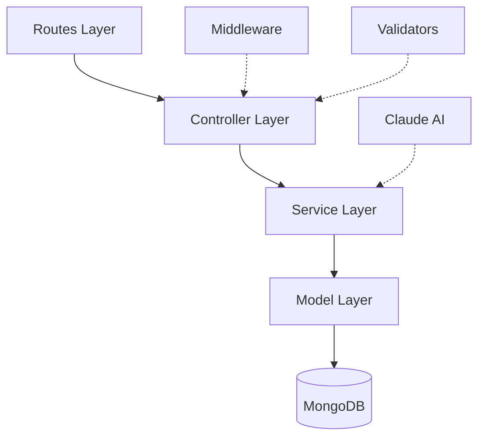
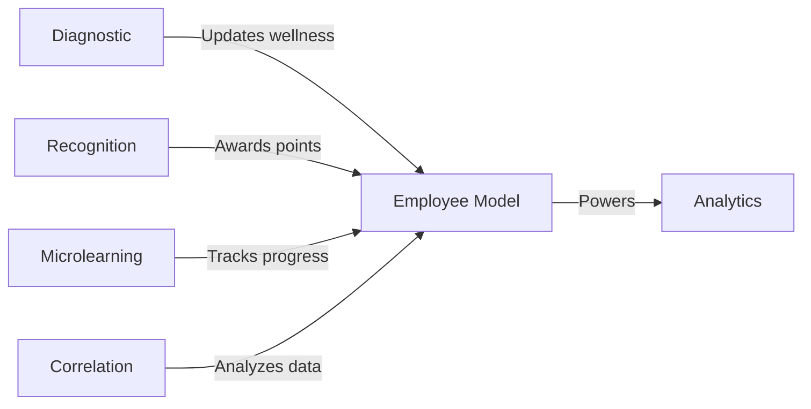

## The 5 CUIDO Modules

CUIDO Backend is organized into 5 specialized modules, each designed to address specific aspects of healthcare employee wellbeing and development:

<CardGroup cols={2}>
  <Card title="Diagnóstico Inteligente" icon="stethoscope" href="/modules/diagnostic">
    AI-powered wellbeing assessment and risk detection
  </Card>
  
  <Card title="Mentoría Virtual" icon="comments" href="/modules/mentorship">
    24/7 AI mentor for healthcare professionals
  </Card>
  
  <Card title="Microformación" icon="graduation-cap" href="/modules/microlearning">
    Personalized bite-sized learning courses
  </Card>
  
  <Card title="Reconocimiento" icon="trophy" href="/modules/recognition">
    Gamified recognition and rewards system
  </Card>
  
  <Card title="Correlación" icon="chart-line" href="/modules/correlation">
    Strategic talent-performance analytics
  </Card>
</CardGroup>

## Module Architecture Pattern

All CUIDO modules follow a consistent 3-layer architecture:



### Layer Responsibilities

<Accordion title="Routes Layer (src/routes/)">
  Defines API endpoints, applies middleware, and validates requests.
  
  **Example:**
  ```javascript
  // src/routes/diagnosticRoutes.js
  import express from 'express';
  import { authenticate, authorize } from '../middleware/auth.js';
  import { validateRequest } from '../middleware/validation.js';
  
  const router = express.Router();
  router.use(authenticate);
  
  router.post('/survey/quick', 
    validateRequest(quickSurveySchema), 
    processQuickSurvey
  );
  ```
</Accordion>

<Accordion title="Controller Layer (src/controllers/)">
  Handles HTTP requests/responses and orchestrates service calls.
  
  **Example:**
  ```javascript
  export const getEmployeeGameStats = asyncHandler(async (req, res) => {
    const { employeeId } = req.params;
    const stats = await recognitionService.getEmployeeGameStats(employeeId);
    sendSuccess(res, 'Estadísticas obtenidas', { stats });
  });
  ```
</Accordion>

<Accordion title="Service Layer (src/services/)">
  Contains business logic, AI integration, and data processing.
  
  **Example:**
  ```javascript
  // src/services/diagnosticService.js
  class DiagnosticService {
    async processQuickSurvey(employeeId, responses) {
      const riskAnalysis = await this.calculateRiskScore(responses);
      await this.updateEmployeeMetrics(employee, responses);
      await this.checkAndGenerateAlerts(employeeId, riskAnalysis);
      return survey;
    }
  }
  ```
</Accordion>

## Module Routes Organization

Routes are mounted in `src/app.js` with consistent prefixes:

```javascript
// src/app.js
import diagnosticRoutes from './routes/diagnosticRoutes.js';
import mentorshipRoutes from './routes/mentorshipRoutes.js';
import microLearningRoutes from './routes/microLearningRoutes.js';
import recognitionRoutes from './routes/recognitionRoutes.js';
import correlationRoutes from './routes/correlationRoutes.js';

// Module routes
app.use('/api/diagnostic', diagnosticRoutes);       // Module 1
app.use('/api/mentorship', mentorshipRoutes);       // Module 2
app.use('/api/microlearning', microLearningRoutes); // Module 3
app.use('/api/recognition', recognitionRoutes);     // Module 4
app.use('/api/correlation', correlationRoutes);     // Module 5

// Supporting routes
app.use('/api/employees', employeeRoutes);
app.use('/api/auth', authRoutes);
```

## Module 1: Diagnóstico Inteligente

<Info>
  **Purpose:** Continuous wellbeing monitoring with AI-powered risk detection
</Info>

### Key Features

- Quick daily surveys with sentiment analysis
- Real-time wellness heatmaps by department
- Automated alert generation for high-risk employees
- Claude AI-powered text analysis
- Gamified survey participation

### Routes Structure

```javascript
// src/routes/diagnosticRoutes.js
router.post('/survey/quick', validateRequest(quickSurveySchema), processQuickSurvey);
router.get('/survey/history/:employeeId', getEmployeeSurveyHistory);
router.get('/wellness-heatmap/:hospitalId', authorize('admin', 'user'), getWellnessHeatmap);
router.get('/alerts', authorize('admin'), getAlerts);
router.put('/alerts/:id/view', authorize('admin'), markAlertAsViewed);
```

### Service Layer Capabilities

<Tabs>
  <Tab title="Risk Analysis">
    ```javascript
    async calculateRiskScore(responses, employee) {
      const weights = {
        moodToday: 0.3,
        workloadLevel: 0.25,
        teamSupport: 0.2,
        jobSatisfaction: 0.25
      };
      
      // Calculate weighted risk score
      let riskScore = 0;
      Object.keys(weights).forEach(key => {
        riskScore += (1 - scores[key]) * weights[key];
      });
      
      // Adjust by employee factors
      const adjustments = await this.getEmployeeRiskAdjustments(employee);
      riskScore = Math.min(1, riskScore * adjustments);
      
      return {
        riskScore: Math.round(riskScore * 100),
        riskLevel: riskScore < 0.3 ? 'bajo' : riskScore < 0.7 ? 'medio' : 'alto'
      };
    }
    ```
  </Tab>
  
  <Tab title="AI Text Analysis">
    ```javascript
    async analyzeTextWithAI(employeeId, text, context = 'feedback') {
      const message = await anthropic.messages.create({
        model: 'claude-3-sonnet-20240229',
        max_tokens: 1000,
        temperature: 0.3,
        messages: [{
          role: 'user',
          content: prompt  // Specialized healthcare prompt
        }]
      });
      
      const analysis = JSON.parse(message.content[0].text);
      
      // Generate high-risk alerts
      if (analysis.riskScore > 70) {
        await this.generateHighRiskAlert(employeeId, analysis);
      }
      
      return sentimentAnalysis;
    }
    ```
  </Tab>
</Tabs>

## Module 2: Mentoría Virtual

<Info>
  **Purpose:** 24/7 AI-powered mentor for healthcare professionals
</Info>

### Routes Structure

```javascript
// src/routes/mentorshipRoutes.js
router.use(authenticate);
router.post('/ask', validateRequest(mentorshipSchema), askMentor);
```

<Note>
  Simple, focused API - single endpoint for asking questions to the AI mentor
</Note>

## Module 3: Microformación

<Info>
  **Purpose:** Personalized bite-sized learning with AI recommendations
</Info>

### Key Features

- Course creation and management
- Smart course recommendations
- Quiz system with instant feedback
- Progress tracking
- Enrollment management

### Routes Structure

```javascript
// src/routes/microLearningRoutes.js
// Course management
router.post('/courses', authorize('admin'), validateRequest(createMicroCourseSchema), createMicroCourse);
router.get('/courses', getAvailableCourses);
router.post('/courses/:courseId/enroll', enrollInCourse);

// Evaluation system
router.post('/courses/:courseId/quiz', validateRequest(submitQuizSchema), submitQuiz);

// Recommendations and progress
router.get('/recommendations/:employeeId', getCourseRecommendations);
router.get('/progress/:employeeId', getEmployeeProgress);
```

## Module 4: Reconocimiento

<Info>
  **Purpose:** Gamified recognition system with points, badges, and rankings
</Info>

### Key Features

- Recognition wall for public achievements
- Points and badge system
- Employee ranking by hospital
- Gamification statistics
- Multiple reward types (points, diplomas, mentions)

### Routes Structure

```javascript
// src/routes/recognitionRoutes.js
router.post('/grant', authorize('admin'), validateRequest(grantRecognitionSchema), grantRecognition);
router.get('/wall/:hospitalId', getRecognitionWall);
router.get('/stats/:employeeId', getEmployeeGameStats);
router.get('/ranking/:hospitalId', getEmployeeRanking);
```

### Recognition Types

<CardGroup cols={3}>
  <Card title="Survey Completion" icon="check">
    **5 points**
    
    Badge: Participativo
  </Card>
  
  <Card title="Course Completion" icon="graduation-cap">
    **20 points**
    
    Badge: Aprendiz
  </Card>
  
  <Card title="Employee of Month" icon="star">
    **100 points**
    
    Badge: Estrella
  </Card>
</CardGroup>

### Service Implementation

```javascript
// src/services/recognitionService.js
class RecognitionService {
  async grantRecognition(employeeId, type, data = {}) {
    const config = this.getRecognitionConfig(type);
    
    const recognition = new Recognition({
      employeeId,
      recognitionType: type,
      rewardType: config.rewardType,
      title: config.title,
      description: config.description,
      pointsAwarded: config.points,
      badgeEarned: config.badge
    });
    
    await recognition.save();
    return recognition;
  }
  
  calculateLevel(totalPoints) {
    if (totalPoints >= 500) return 5;
    if (totalPoints >= 300) return 4;
    if (totalPoints >= 150) return 3;
    if (totalPoints >= 50) return 2;
    return 1;
  }
}
```

## Module 5: Correlación

<Info>
  **Purpose:** Strategic analytics connecting talent investment with organizational performance
</Info>

### Key Features

- Monthly metrics generation
- Historical trend analysis
- Executive dashboards
- Strategic reports
- ROI calculations

### Routes Structure

```javascript
// src/routes/correlationRoutes.js
router.use(authenticate);
router.use(authorize('admin')); // Admin-only module

router.post('/metrics/:hospitalId', generateMonthlyMetrics);
router.get('/metrics/:hospitalId/history', getHistoricalMetrics);
router.get('/report/:hospitalId', generateStrategicReport);
router.get('/dashboard/:hospitalId', getExecutiveDashboard);
```

<Note>
  This module requires admin privileges as it contains sensitive strategic data
</Note>

## Shared Employee Model

All modules interact with the central Employee model:

```javascript
// src/models/Employee.js
const employeeSchema = new mongoose.Schema({
  personalInfo: {
    name: String,
    email: String,
    identification: String,
    phoneNumber: String
  },
  jobInfo: {
    position: { type: String, enum: ['medico', 'enfermero', 'auxiliar_enfermeria', 'administrativo', 'otro'] },
    department: { type: String, enum: ['urgencias', 'hospitalizacion', 'consulta_externa', 'administracion', 'otro'] },
    startDate: Date,
    shift: { type: String, enum: ['mañana', 'tarde', 'noche', 'rotativo'] }
  },
  wellnessMetrics: {
    currentMoodScore: Number,
    averageWorkload: Number,
    teamSupportScore: Number,
    satisfactionScore: Number,
    riskLevel: { type: String, enum: ['bajo', 'medio', 'alto'] }
  },
  gamification: {
    totalPoints: { type: Number, default: 0 },
    currentStreak: { type: Number, default: 0 },
    maxStreak: { type: Number, default: 0 },
    level: { type: Number, default: 1 },
    badges: [{
      name: String,
      earnedAt: Date,
      description: String
    }]
  }
});
```

## Cross-Module Integration



### Integration Examples

<Tabs>
  <Tab title="Survey → Gamification">
    When a survey is completed:
    1. **Diagnostic module** processes responses
    2. Awards 5 points to employee
    3. **Recognition module** checks for badge eligibility
    4. Updates streak counter
  </Tab>
  
  <Tab title="Course → Recognition">
    When a course is completed:
    1. **Microlearning module** marks completion
    2. Awards 20 points
    3. **Recognition module** grants diploma badge
    4. Appears on recognition wall
  </Tab>
  
  <Tab title="All → Analytics">
    Correlation module aggregates:
    - Survey participation rates
    - Learning completion rates
    - Recognition patterns
    - Wellness trends
  </Tab>
</Tabs>

## Service Layer Pattern

All modules follow this service pattern:

```javascript
// Singleton service export
class ModuleService {
  async primaryOperation() {
    // Business logic
    // AI integration (if applicable)
    // Database operations
    // Alert generation
  }
  
  async helperMethod() {
    // Supporting functionality
  }
}

export default new ModuleService();
```

## Next Steps

<CardGroup cols={2}>
  <Card title="Gamification" icon="gamepad" href="/concepts/gamification">
    Deep dive into the points, badges, and levels system
  </Card>
  
  <Card title="Module Details" icon="book" href="/modules/diagnostic">
    Explore detailed documentation for each module
  </Card>
</CardGroup>